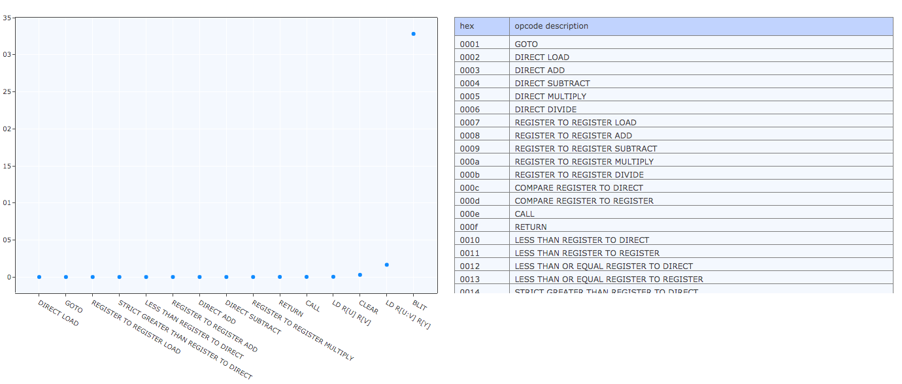

# VLAHB

- An original assmebly langauge you can use to write your own games.
- For details on the underlying mechanics of the language, read this [blog post](http://adamkulidjian.com/vlahb.html).

`V`irtual machine 
`L`inker 
`A`ssembly 
`H`ex 
`B`inary 

## Building

`$ ./run.sh`

(NB Pick which asm files to compile on [this line of run.sh](https://github.com/Kully/VLAHB/blob/master/run.sh#L3))

#### Statically Linking files
`-s` is a flag for statically-linking all the .asm files in the /asm directory. If you list 1 or more .asm filenames w/o the -s flag, it will only compile those files and start at the first one. If you list 1 or more .asm filenames with the `-s` flag, it will compile _all_ the files in the /asm directory and start with the first one.

| code | meaning |
|:-------|:------|
| `$ python3 assembler.py A.asm B.asm C.asm` | Compile A, B and C and start the vm at A.asm |
| `$ python3 assembler.py C.asm -s` | Compile all files in /asm and start at top of C.asm |
| `$ python3 assembler.py B.asm C.asm -s` | Compile all files in /asm and start at top of B.asm |

#### Debug Messages
Turn on DEBUG mode [here](https://github.com/Kully/VLAHB/blob/master/vm.c#L17) to get helpful debug messages printed per instruction in terminal. _Slows down virtual machine a ton._

#### View Machine Code
Run `$ xxd -c 4 bin/file.bin` to view the machine code displayed as hex in the terminal.

#### Specs

- virtual machine, assembler/compiler
- 48 opcodes
- 262KB of ram
- 160x144 pixel display
- static linking capable
- 60 fps
- vm runs on SDL2
- written in C and Python
- lots of fun! :smile_cat:

